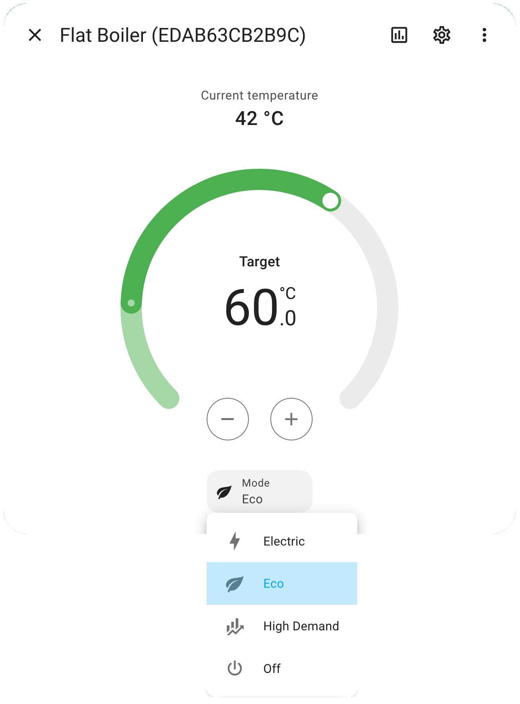

[](https://discord.gg/4sRmgb9Vph)
[](https://github.com/qbaware/homeassistant-eldom/actions/workflows/hassfest-validation.yaml)
[](https://github.com/qbaware/homeassistant-eldom/actions/workflows/hacs-action-validation.yaml)

---

# Eldom Integration For Home Assistant

Connect your [Eldom](https://eldominvest.com/en/index.html) devices to Home Assistant and operate them via Eldom's Cloud APIs with [pyeldom](https://github.com/qbaware/pyeldom).


[](https://www.buymeacoffee.com/danielgospodinow), or you can just ⭐️ the repository. I'd love that too. :smile:

---

## ⚠️ Attention

Release [5.0.1](https://github.com/qbaware/homeassistant-eldom/releases/tag/5.0.1) contains a breaking change in the config flow. It requires you to re-add your account. This is **safe** for your existing automations and no negative impact is expected.

## Supported devices

Currently, there's primarely support for devices that are managed by the `My Eldom` app (or the `myeldom.com` website).

Devices that are managed via the `Eldom` app (or the `iot.myeldom.com` website) are in experimental support from release [5.0.1](https://github.com/qbaware/homeassistant-eldom/releases/tag/5.0.1). Some of the devices under experimentation are flat boilers and convector heaters.

## Features

This integration allows you to control Eldom devices via Home Assistant.

Note that there's only one way to control your Eldom devices - via their Cloud APIs. There's no support for local network control.

#### 1. Flat boilers

- Operational mode selection
  - `Electric` (corresponds to "Heating")
  - `Eco` (corresponds to "Smart")
  - `High Demand` (corresponds to "Study")
  - `Off`
- Set target temperature
- Display current temperature
- Enable `Powerful mode` switch (only works while `Eco` mode is enabled)
- Display sensors
  - Heater is currently on/off
  - Day energy consumption
  - Night energy consumption
  - Saved energy

#### 2. Smart boilers

- Operational mode selection
  - `Electric` (corresponds to "Heating")
  - `Eco` (corresponds to "Smart")
  - `High Demand` (corresponds to "Study")
  - `Off`
- Set target temperature
- Display current temperature
- Enable `Powerful mode` switch (only works while `Eco` mode is enabled)
- Display sensors
  - Heater is currently on/off
  - Day energy consumption
  - Night energy consumption
  - Saved energy

#### 3. Convector heaters

- Operational mode selection
  - `Heat`
  - `Off`
- Set target temperature
- Display current temperature

### Showcase




## Installation

### HACS Installation (Recommended)

0. Install HACS if it's not already installed. Look at [this](https://www.youtube.com/watch?v=0hDyVoDGFbc) video.
1. Open HACS.
2. Select `Integrations`, then select the 3-dots in the upper-right corner, then select `Custom Repositories`.
3. Put the reposity URL in the `Repository` field, then select `Integration` in the `Category` dropdown list and click `Add`.
4. Now, you can search for `Eldom` in HACS and install the integration.
5. After the installation, you need to restart Home Assistant.
6. Now, you can proceed with [Usage](#usage).

I've made a video tutorial on YouTube on how to do all this:

[](https://youtu.be/57qsCXNVMMA)

### Custom components

1. Download or clone the integration to your local machine.
2. Navigate to the `custom_components` directory in your Home Assistant installation directory.
3. Copy the folder `custom_components/eldom` from the downloaded integration to the Home Assistant `custom_components` directory.
4. Restart Home Assistant.

## Usage

- After installation, go to `Settings > Devices & services > Add integration` and search for `Eldom`.
- Provide an Eldom account `email` and `password` and click `Submit`.

## Custom UI Card

If you find the default card boring, you can try out this custom one.


<details>
  <summary>YAML</summary>
  
  ```yaml
  features:
    - type: target-temperature
    - type: water-heater-operation-modes
      operation_modes:
        - "off"
        - eco
        - electric
        - high_demand
  type: tile
  entity: water_heater.flat_boiler_edab63cb2b9c
  color: primary
  name: Flat Boiler
  hide_state: false
  show_entity_picture: false
  vertical: true
  state_content:
    - state
    - last-changed
  ```
</details>

## Community

For additional questions, you can head over to our [Discord channel](https://discord.gg/4sRmgb9Vph).
