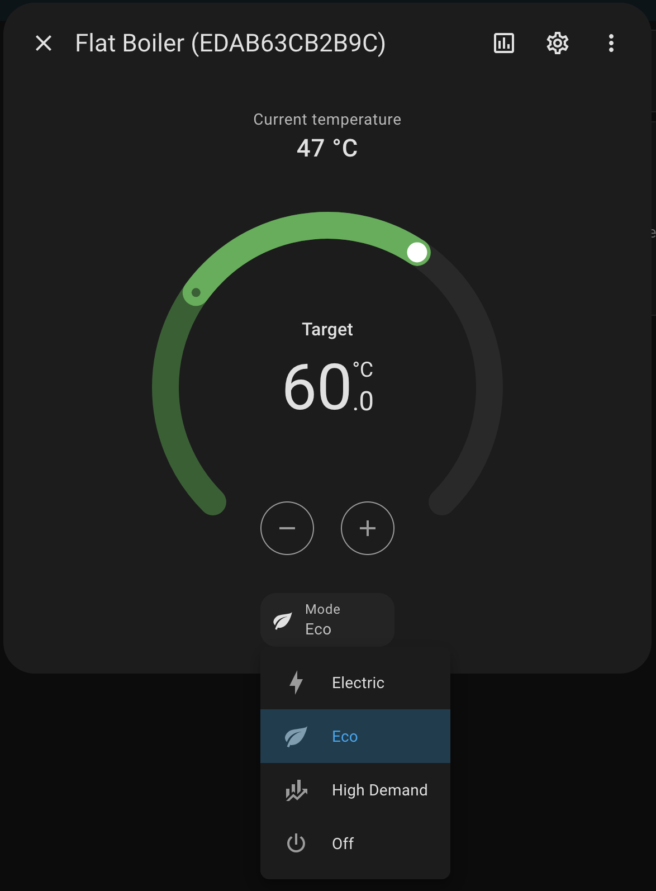
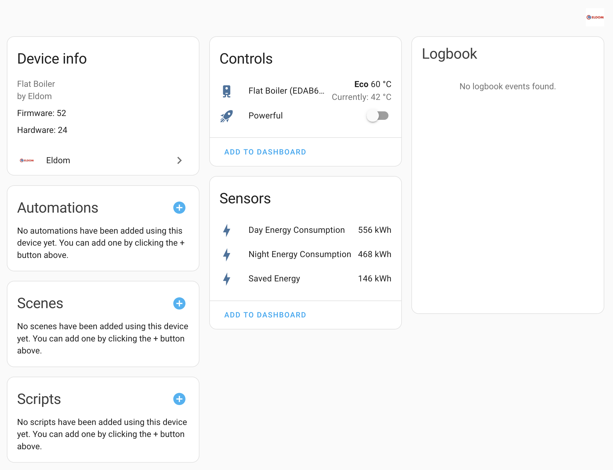

# Eldom Integration For Home Assistant

Connect your [Eldom](https://eldominvest.com/en/index.html) devices to Home Assitant and operate them via Eldom's Cloud APIs with [pyeldom](https://github.com/qbaware/pyeldom).

---

## Features

This integration allows you to control Eldom devices via Home Assistant.

Note that there's only one way to control your Eldom devices - via their Cloud APIs. There's no support for local network control.

Supported devices:

- Flat boilers
  - Operational mode selection
    - `Electric` (corresponds to "Heating")
    - `Eco` (corresponds to "Smart")
    - `High Demand` (corresponds to "Study")
    - `Off`
  - Enable `Powerful mode` switch (only works while `Eco` mode is enabled)

## Usage

- After installation, go to `Settings > Devices & services > Add integration` and search for `Eldom`.
- Provide an Eldom account `email` and `password` and click `Submit`.
